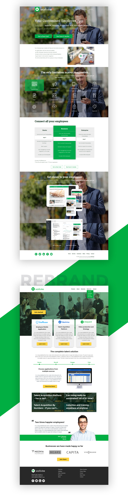

Not shown here are the prototypes presented to potential clients like an interactive video platform to help employers train and onboard their new employees more efficiently and a damage record and report application to help Neovia track and report incidents of their deliveries with the purpose of understanding and mitigating the incidents, and improving their infrastructure.

 
 

